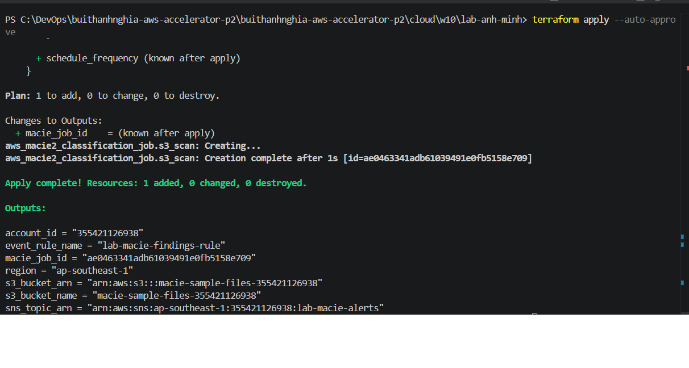
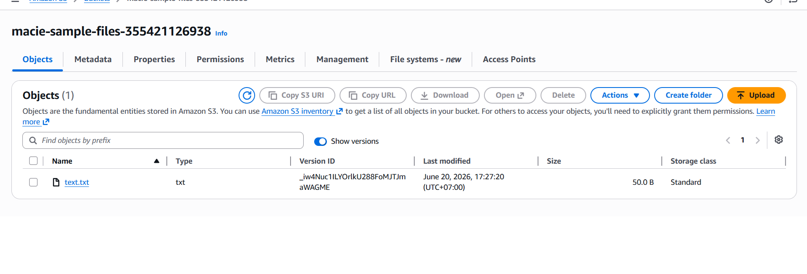
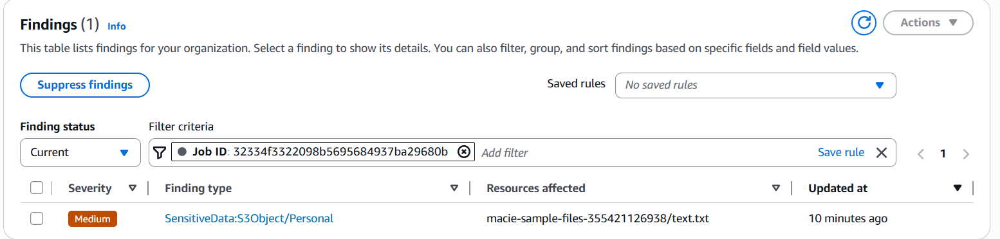
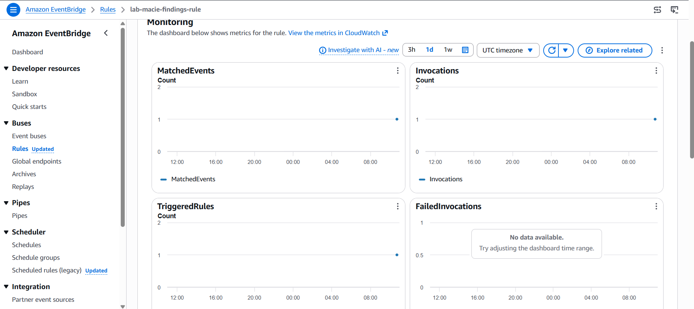
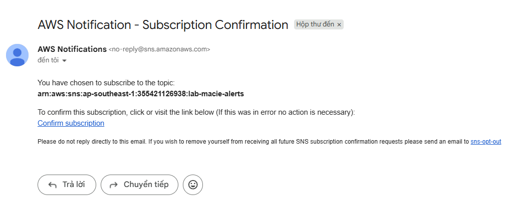
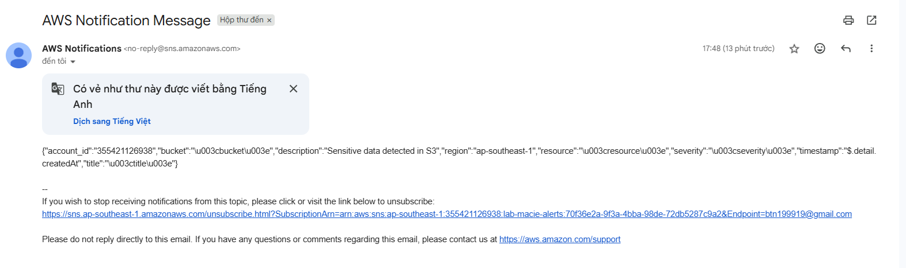

# Lab - Phát hiện dữ liệu nhạy cảm trong Amazon S3 bằng Amazon Macie

Lab này dựng đúng luồng trong slide: User upload sample files lên S3 Bucket -> Amazon Macie classification job quét bucket tìm dữ liệu nhạy cảm -> sinh ra Findings -> EventBridge Rule bắt các finding mức Medium/High -> SNS gửi email cảnh báo.

## Tài nguyên được tạo

- 1 S3 bucket lưu sample files, có versioning, server-side encryption (SSE-S3/AES256) và Public Access Block (chặn toàn bộ public access)
- 1 Macie account được enable trong region hiện tại (`status = ENABLED`, `finding_publishing_frequency = FIFTEEN_MINUTES` để demo nhanh thay vì mặc định 6 giờ)
- 1 Macie classification job loại `ONE_TIME`, dùng `managed_data_identifier_selector = ALL` để quét toàn bộ bucket bằng tất cả managed data identifier của Macie (SSN, credit card, v.v.)
- 1 SNS topic và 1 email subscription để nhận cảnh báo
- 1 SNS topic policy chỉ cho phép đúng EventBridge rule của lab này được publish vào topic (least-privilege)
- 1 EventBridge rule bắt event `Macie Finding` với `detail.severity.description` thuộc `Medium` hoặc `High` (Macie không có mức "Critical")
- 1 EventBridge target gắn `input_transformer` để định dạng lại nội dung gửi sang SNS (severity, title, bucket, resource, account_id, region, timestamp)

## Cách chạy

```bash
terraform init
terraform validate
terraform plan
terraform apply
```

Trước khi `apply`, tạo file `terraform.tfvars` và khai báo các biến:

```hcl
alert_email = "your-email@example.com"
aws_region  = "us-east-1"
environment = "lab"
bucket_name = "macie-sample-files"
```

Sau khi apply xong, vào inbox email và bấm confirm SNS subscription. Nếu chưa confirm thì EventBridge vẫn gửi event vào SNS nhưng bạn sẽ không nhận được mail.

## Cách kiểm tra

1. Lấy tên bucket từ output và tạo file mẫu chứa dữ liệu giả định nhạy cảm:
   ```bash
   echo "Credit Card: 4111-1111-1111-1111" > sensitive_data.txt
   aws s3 cp sensitive_data.txt s3://$(terraform output -raw s3_bucket_name)/
   ```
2. Kiểm tra trạng thái job (job loại `ONE_TIME` tự động chạy ngay sau khi `terraform apply`, không cần lệnh "start" thủ công vì AWS CLI macie2 không có command này):
   ```bash
   JOB_ID=$(terraform output -raw macie_job_id)
   aws macie2 describe-classification-job --job-id $JOB_ID
   ```
3. Vào AWS Console -> Macie -> Findings, chờ job chạy xong (vài phút tùy dung lượng dữ liệu) và xem finding mới xuất hiện.
4. Vào CloudWatch -> Logs/Rules hoặc EventBridge console, kiểm tra rule từ output `event_rule_name` đã match event.
5. Kiểm tra email nhận được cảnh báo từ SNS (chỉ các finding mức Medium/High mới được gửi).

## Bằng chứng

### 1. Terraform apply thành công

Chèn hình tại đây:



### 2. S3 bucket đã có sample file và bật mã hóa/versioning

Chèn hình tại đây:



### 3. Macie classification job hoàn tất, có Findings

Chèn hình tại đây:



### 4. EventBridge rule bắt được event Macie Finding

Chèn hình tại đây:



### 5. SNS subscription đã confirm

Chèn hình tại đây:



### 6. Email nhận cảnh báo phát hiện dữ liệu nhạy cảm

Chèn hình tại đây:



## Dọn dẹp

```bash
terraform destroy
```

## Lưu ý

- Macie tính phí theo dung lượng dữ liệu được quét (xem [AWS pricing](https://aws.amazon.com/macie/pricing/)).
- Email subscription cần xác nhận thủ công trước khi nhận được cảnh báo.
- Thời gian job chạy phụ thuộc vào dung lượng dữ liệu trong bucket.
- Chỉ finding mức `Medium` và `High` mới kích hoạt EventBridge rule và gửi email; finding mức `Low` sẽ không gửi cảnh báo.