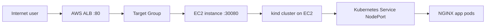

# K8s on AWS - Terraform 1-Click

This project provisions one EC2 instance on AWS, bootstraps a local Kubernetes
cluster with `kind`, deploys a lightweight demo app into that cluster, and
exposes the app to the Internet through an AWS Application Load Balancer (ALB).

The Terraform configuration wires two providers:

- `hashicorp/aws`: creates the AWS infrastructure.
- `hashicorp/kubernetes`: declares the Kubernetes provider integration for the
  cluster workflow.

## Assignment Requirements

| Requirement | Implementation |
| --- | --- |
| Build infrastructure with Terraform | `main.tf` creates IAM, security groups, EC2, ALB, target group, listener, and target attachment. |
| Use one EC2 instance | `aws_instance.k8s` provisions one Amazon Linux 2023 EC2 instance. |
| Run minikube or kind on EC2 | `user_data.sh.tftpl` installs Docker, `kind`, and `kubectl`, then creates a `kind` cluster named `lab`. |
| Run the app inside Kubernetes | The app is deployed as Kubernetes `ConfigMap`, `Deployment`, and `Service` objects. |
| Do not install the app directly on EC2 | EC2 only hosts Docker/kind; the actual web app runs in NGINX pods inside Kubernetes. |
| Expose the app to the Internet through ALB | Public ALB listens on port `80` and forwards traffic to the EC2 NodePort. |
| One-click automation from Terraform | `terraform apply` creates AWS infrastructure, bootstraps kind, deploys the app, and wires ALB traffic. |
| Use at least two Terraform providers | The configuration uses `aws` and `kubernetes` providers in `versions.tf`. |

## Architecture



Traffic flow:

1. User opens the ALB DNS name in a browser.
2. ALB receives HTTP traffic on port `80`.
3. ALB forwards traffic to the EC2 instance on `var.app_port`, default `30080`.
4. `kind` maps the EC2 host port to the Kubernetes node.
5. Kubernetes `NodePort` service routes traffic to the NGINX app pods.

## Providers

### AWS Provider

The AWS provider manages:

- Default VPC and subnet discovery.
- IAM role and instance profile for EC2.
- Security groups for ALB and EC2.
- EC2 instance running the Kubernetes node.
- ALB, target group, listener, and target group attachment.

### Kubernetes Provider

The Kubernetes provider is declared as the second provider:

```hcl
provider "kubernetes" {
  config_path = var.kubeconfig_path
}
```

This satisfies the requirement to wire a second provider into the Terraform
configuration. In the current implementation, Kubernetes objects are applied by
`kubectl` inside EC2 user data because the `kind` cluster is created on the EC2
instance during the same Terraform run.

If a stricter grading rule requires Terraform state to directly manage the
Kubernetes objects, the `ConfigMap`, `Deployment`, and `Service` should be moved
from `user_data.sh.tftpl` into `kubernetes_*` Terraform resources after making
the remote kind kubeconfig reachable by the local Terraform run.

## Files

| File | Purpose |
| --- | --- |
| `versions.tf` | Terraform version, AWS provider, Kubernetes provider. |
| `variables.tf` | Region, project name, instance type, app port, tags, kubeconfig path. |
| `main.tf` | AWS infrastructure and ALB-to-EC2 wiring. |
| `user_data.sh.tftpl` | EC2 bootstrap script that installs Docker/kind/kubectl and deploys the app. |
| `outputs.tf` | ALB DNS name, app URL, and EC2 instance ID. |

## Prerequisites

- Terraform `>= 1.6.0`.
- AWS credentials configured locally.
- AWS account with permission to create EC2, IAM, security groups, and ALB
  resources.
- A default VPC with at least two subnets in the selected region.

Default region:

```hcl
ap-southeast-1
```

## Deploy

Initialize Terraform:

```bash
terraform init
```

Validate the configuration:

```bash
terraform validate
```

Create everything with one Terraform apply:

```bash
terraform apply -auto-approve
```

Get the app URL:

```bash
terraform output app_url
```

Open the output URL in a browser. The app should show the Pixel Game Store demo
page served from Kubernetes through the AWS ALB.

## Verify After Deployment

Check the ALB URL:

```bash
curl "$(terraform output -raw app_url)"
```

Check EC2 bootstrap logs with SSM or SSH:

```bash
sudo tail -f /var/log/user-data.log
```

Check Kubernetes resources on the EC2 instance:

```bash
kubectl get nodes
kubectl get pods
kubectl get svc
```

Expected Kubernetes service:

```text
game-store   NodePort   ...   80:30080/TCP
```

## Destroy

Remove all AWS resources created by this project:

```bash
terraform destroy -auto-approve
```

## Notes

- The ALB security group allows inbound HTTP from the Internet.
- The EC2 security group only allows app traffic from the ALB security group.
- The app port is controlled by `var.app_port`, default `30080`.
- The app is intentionally lightweight: static HTML served by `nginx:1.27-alpine`.
- The project uses the default VPC to keep the lab small and focused on the
  Terraform, EC2, Kubernetes, and ALB integration.
