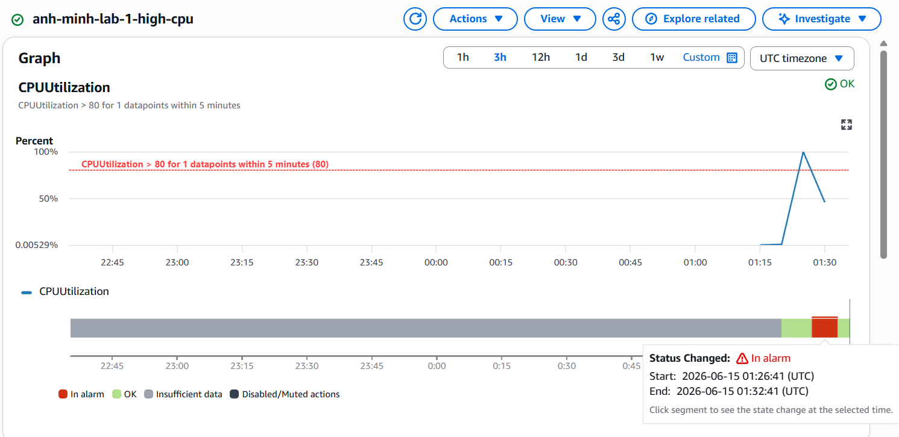
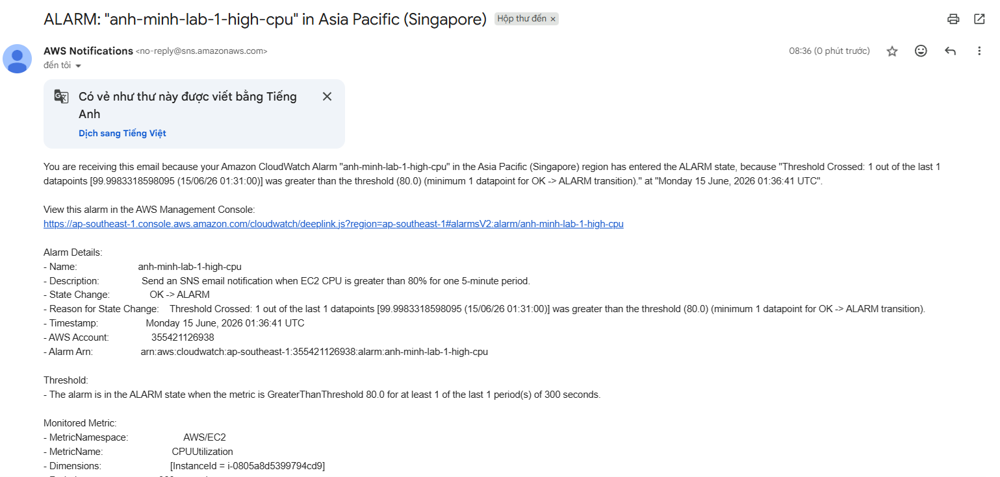

# Lab 1 - CPU Alarm to Email Alert via SNS

Lab này dựng đúng luồng trong slide: EC2 -> CloudWatch CPU alarm -> SNS topic -> email subscription.

## Tài nguyên được tạo

- 1 EC2 Amazon Linux 2023 kích thước `t3.micro`
- 1 IAM role cho EC2, chỉ gắn `AmazonSSMManagedInstanceCore`
- 1 security group không mở inbound, chỉ cho outbound
- 1 SNS topic và 1 email subscription
- 1 CloudWatch alarm theo metric `AWS/EC2 CPUUtilization`

## Cách chạy

```powershell
Copy-Item terraform.tfvars.example terraform.tfvars
notepad terraform.tfvars
terraform init
terraform validate
terraform apply
```

Đổi `notification_email` từ `your-email@example.com` sang email thật của bạn. Sau khi apply, vào inbox và bấm confirm subscription của SNS; nếu chưa confirm thì alarm sẽ không gửi email.

## Test alarm

Cách an toàn nhất là dùng SSM Session Manager vào instance rồi chạy:

```bash
for i in 1 2; do yes > /dev/null & done
```

Hoặc đặt `enable_cpu_test = true` trước khi apply để instance tự chạy CPU test ngắn trong lần boot đầu tiên.

Alarm đang cấu hình theo yêu cầu slide:

- Threshold: CPU > 80%
- Period: 5 minutes
- Datapoints: 1 out of 1
- Action: gửi notification tới SNS topic



# Email


## Dọn dẹp

```powershell
terraform destroy
```
