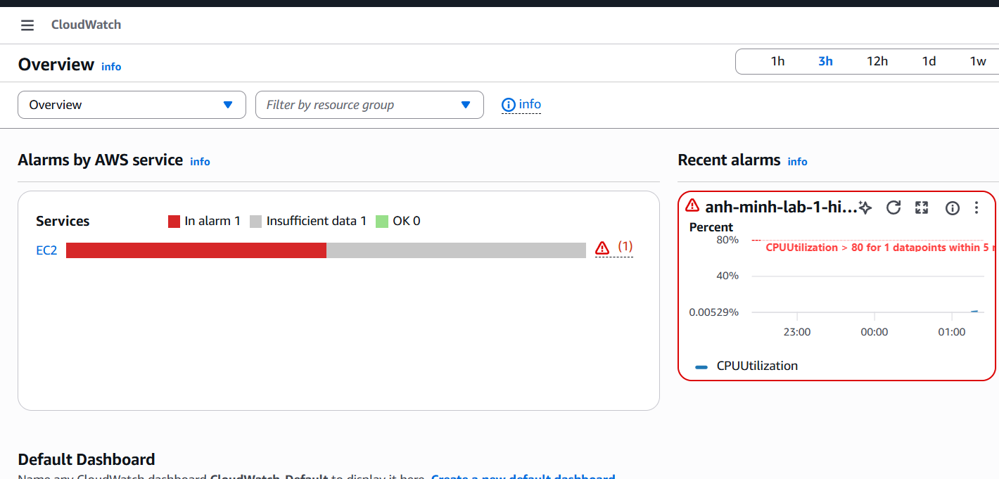

# Lab 2 - Install CloudWatch Agent and Build EC2 Dashboard

Lab này dựng phần trong slide: EC2 có IAM role `CloudWatchAgentServerPolicy`, cài CloudWatch Agent, start agent, kiểm tra status, và tạo CloudWatch dashboard theo dõi EC2.

## Tài nguyên được tạo

- 1 EC2 Amazon Linux 2023 kích thước `t3.micro`
- 1 IAM role cho EC2 với:
  - `CloudWatchAgentServerPolicy`
  - `AmazonSSMManagedInstanceCore`
- 1 security group không mở inbound, chỉ cho outbound
- 1 CloudWatch Agent config thu thập:
  - `mem_used_percent`
  - `disk_used_percent` cho `/`
- 1 CloudWatch dashboard gồm CPU, network, memory, disk
- 1 SNS topic, 1 email subscription placeholder, và 1 EC2 status-check alarm nhỏ để luyện notification

## Cách chạy

```powershell
Copy-Item terraform.tfvars.example terraform.tfvars
notepad terraform.tfvars
terraform init
terraform validate
terraform apply
```

Đổi `notification_email` từ `your-email@example.com` sang email thật nếu bạn muốn nhận alarm status check. Sau apply, xác nhận email SNS trong inbox.

## Kiểm tra CloudWatch Agent

Vào EC2 bằng SSM Session Manager rồi chạy:

```bash
sudo /opt/aws/amazon-cloudwatch-agent/bin/amazon-cloudwatch-agent-ctl -m ec2 -a status
```

Xem dashboard bằng output `dashboard_url`, hoặc vào AWS Console -> CloudWatch -> Dashboards -> chọn dashboard được tạo.



## Dọn dẹp

```powershell
terraform destroy
```
