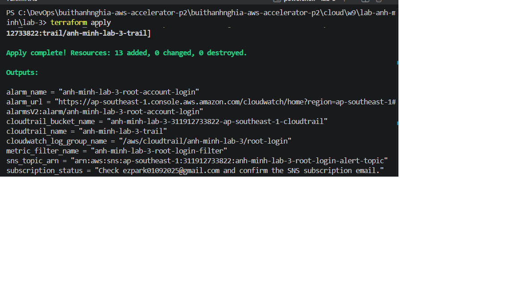
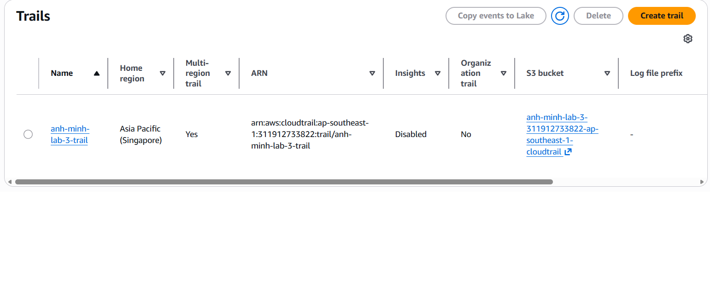
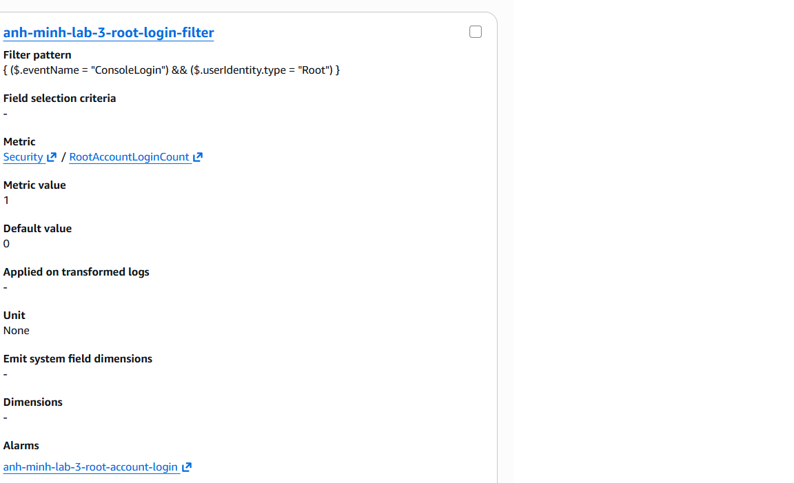
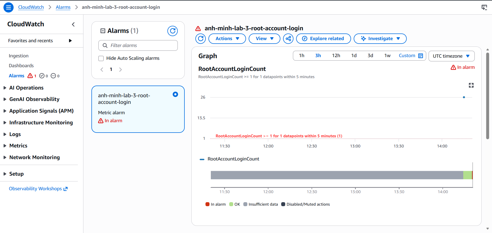
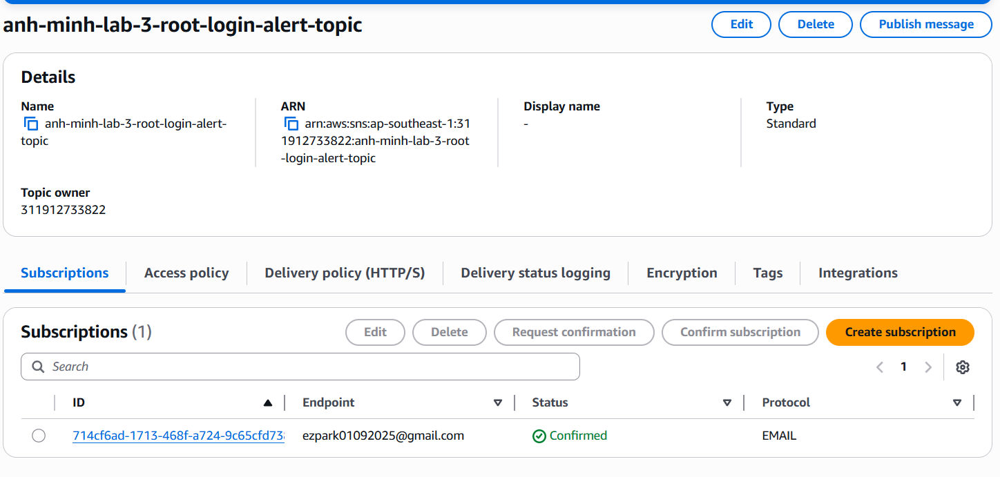
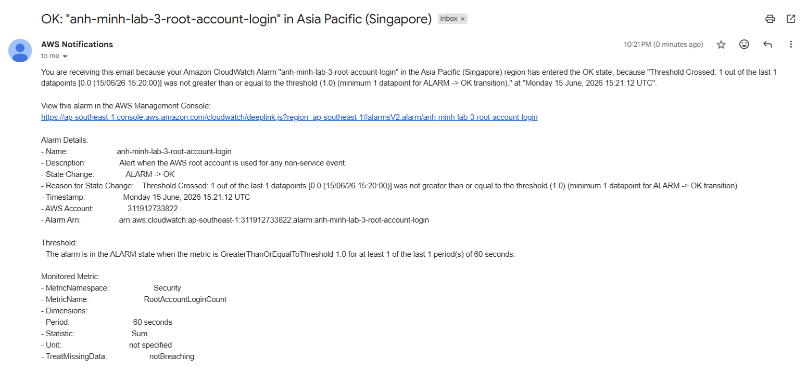

# Lab 3 - Alert on AWS Root Account Login

Lab này dựng đúng luồng trong slide: CloudTrail ghi nhận root account activity -> gửi log sang CloudWatch Logs -> metric filter đếm sự kiện root login -> CloudWatch Alarm -> SNS gửi email/SMS.

## Tài nguyên được tạo

- 1 CloudTrail multi-region trail, có ghi management events
- 1 S3 bucket lưu CloudTrail event history
- 1 CloudWatch Logs group nhận log từ CloudTrail
- 1 IAM role cho CloudTrail ghi log vào CloudWatch Logs
- 1 CloudWatch Logs metric filter:
  - Pattern: `{ ($.userIdentity.type = "Root") && ($.eventType != "AwsServiceEvent") }`
  - Namespace: `Security`
  - Metric name: `RootAccountLoginCount`
  - Value: `1`
- 1 CloudWatch alarm báo khi `RootAccountLoginCount >= 1` trong 5 phút
- 1 SNS topic, 1 email subscription, và SMS subscription nếu có nhập số điện thoại

## Cách chạy

```powershell
Copy-Item terraform.tfvars.example terraform.tfvars
notepad terraform.tfvars
terraform init
terraform validate
terraform apply
```

Đổi `notification_email` từ `your-email@example.com` sang email thật của bạn. Nếu muốn nhận SMS, nhập `notification_phone_number` theo định dạng E.164, ví dụ `+84123456789`; nếu không dùng SMS thì để rỗng.

Sau khi apply, vào inbox và bấm confirm subscription của SNS. Nếu chưa confirm thì CloudWatch alarm vẫn đổi trạng thái nhưng SNS chưa gửi email được.

## Cách kiểm tra

1. Vào AWS Console -> CloudTrail -> Trails, kiểm tra trail đã bật.
2. Vào CloudWatch -> Log groups, mở log group `/aws/cloudtrail/anh-minh-lab-3/root-login`.
3. Vào CloudWatch -> All alarms, mở alarm từ output `alarm_url`.
4. Đăng nhập AWS bằng root account một lần để tạo sự kiện kiểm thử.
5. Đợi vài phút để CloudTrail chuyển event sang CloudWatch Logs, metric filter tạo metric, và alarm chuyển sang `In alarm`.
6. Kiểm tra email/SMS SNS gửi thông báo.

Lưu ý: root account chỉ nên dùng để kiểm thử ngắn theo yêu cầu bài lab. Sau khi test xong nên đăng xuất root và tiếp tục dùng IAM user/role hằng ngày.

## Bằng chứng

### 1. Terraform apply thành công

Chèn hình tại đây:



### 2. CloudTrail đã bật và gửi log sang CloudWatch Logs

Chèn hình tại đây:



### 3. Metric filter bắt sự kiện root login

Chèn hình tại đây:



### 4. CloudWatch alarm cấu hình ngưỡng `>= 1`

Chèn hình tại đây:



### 5. SNS subscription đã confirm

Chèn hình tại đây:



### 6. Email/SMS nhận cảnh báo root login

Chèn hình tại đây:



## Dọn dẹp

```powershell
terraform destroy --auto-approve
```

Do S3 bucket CloudTrail có bật versioning, cấu hình Terraform đang đặt `force_destroy = true` để khi destroy bài lab có thể xóa bucket cùng các object bên trong.
